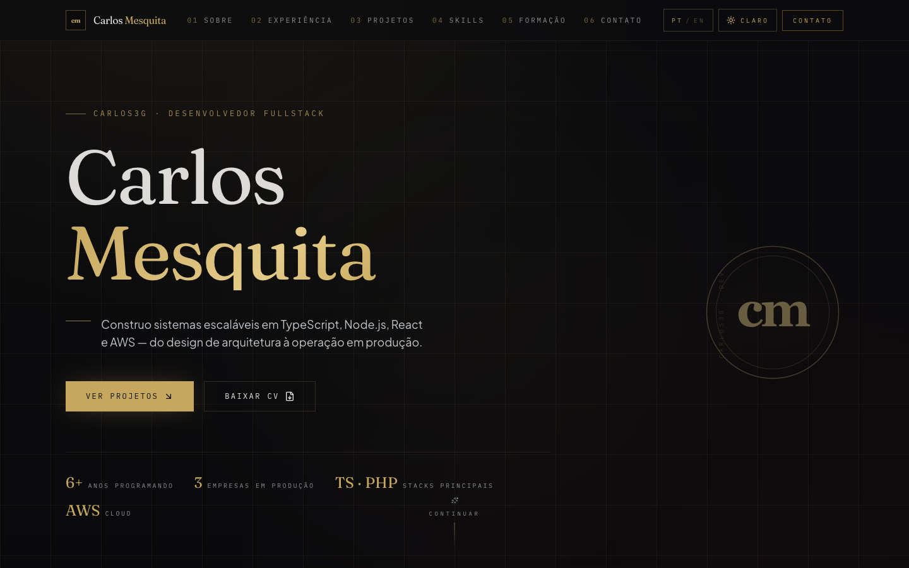
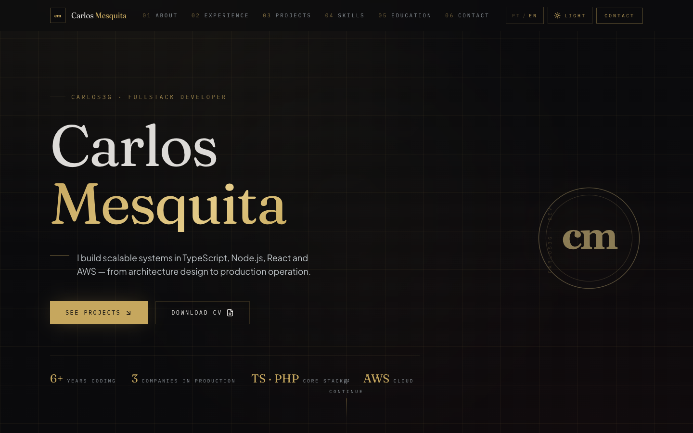
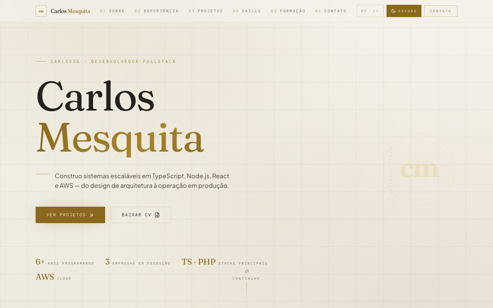
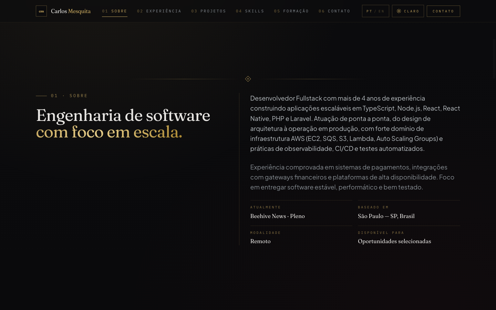
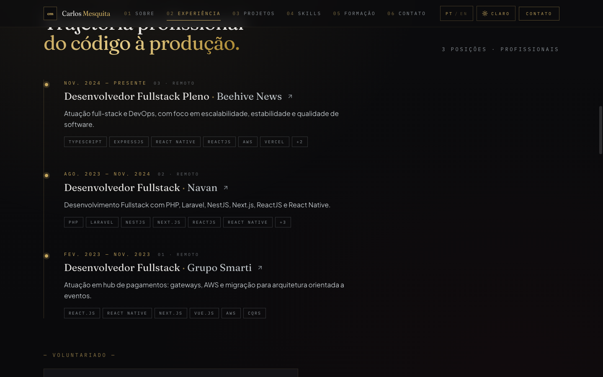
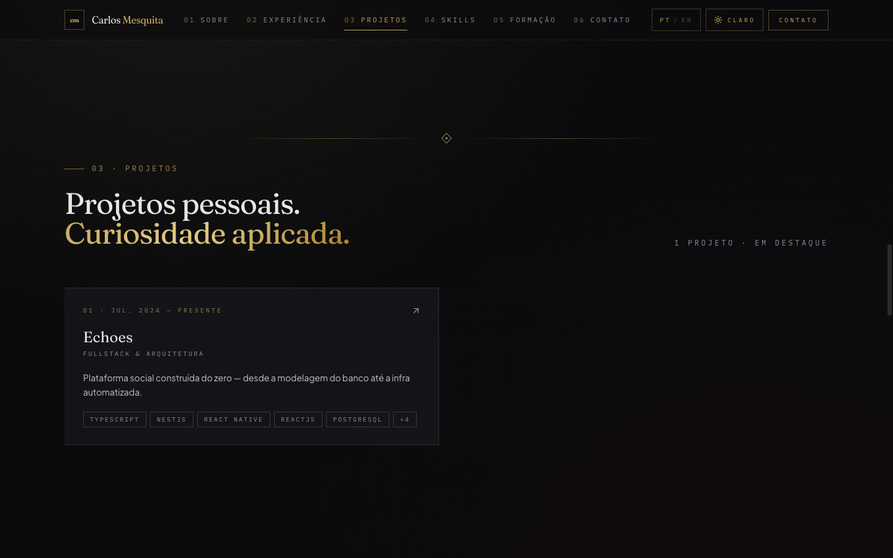
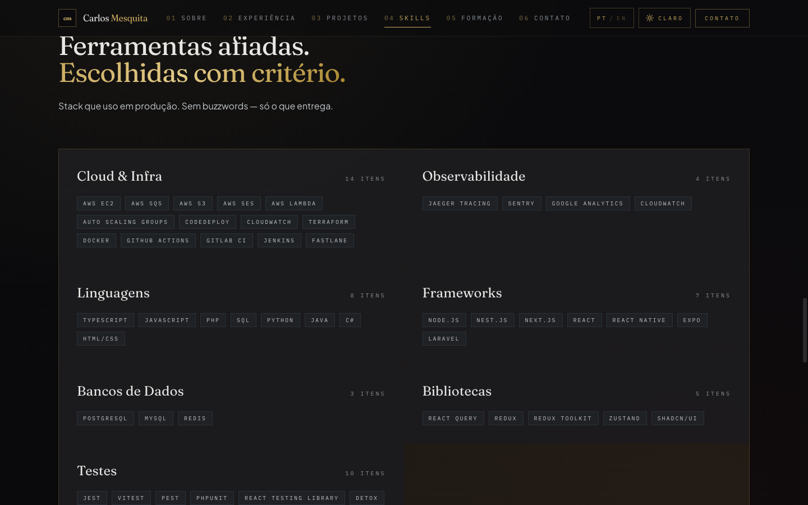
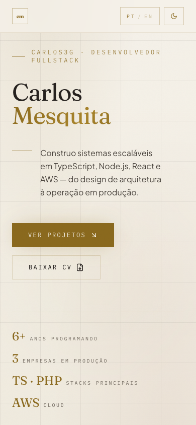

# carlos3g.dev

Personal portfolio for **Carlos Mesquita** — Fullstack Developer working with TypeScript, Node.js, React, React Native and AWS.

🌐 Live: **[www.carlos3g.dev](https://www.carlos3g.dev)** &nbsp;·&nbsp; 🇧🇷 [Português](https://www.carlos3g.dev/) &nbsp;·&nbsp; 🇺🇸 [English](https://www.carlos3g.dev/en)



---

## Stack

[Next.js 15 (App Router)](https://nextjs.org) · [React 19](https://react.dev) · [TypeScript (strict)](https://www.typescriptlang.org) · [Tailwind CSS 3](https://tailwindcss.com) · [shadcn/ui](https://ui.shadcn.com) · [Zustand](https://zustand-demo.pmnd.rs) · [next-intl](https://next-intl.dev) · [Vercel Analytics & Speed Insights](https://vercel.com/docs/analytics) · deployed on [Vercel](https://vercel.com)

## Features

- 🌐 **Bilingual** — Portuguese (default) and English, locale-prefixed URLs (`/`, `/en`), `hreflang` metadata, locale-aware `<Link>` and middleware-based detection via `next-intl`.
- 🎨 **Dark / light themes** with FOUC-prevention boot script — preference persisted in `localStorage`.
- ⚡ **Static rendering** — both locales pre-rendered at build time, middleware only handles redirects.
- 📱 **Mobile-first responsive** layout, accessible nav with active-section tracking via `IntersectionObserver`.
- 📊 **Vercel Analytics** + **Speed Insights** wired into the root layout.
- 🚀 **CI/CD** on GitHub Actions — production deploys on push to `main`, preview deploys on every PR.

## Screenshots

### Hero — English


### Light theme


### About


### Experience


### Projects


### Skills


### Mobile



## Local development

Requires Node 20+ and Yarn 4 (Berry).

```bash
yarn install --immutable
yarn dev          # http://localhost:3000
yarn build
yarn start
```

## Project structure

```
app/[locale]/            # Localized App Router segment (root layout + page)
components/
  sections/              # Hero, About, Experience, Projects, Skills, Education, Contact
  ui/                    # shadcn primitives (button, badge, dialog)
  ornaments/             # Decorative SVG bits
  nav.tsx                # Top nav with active-section tracking
  locale-toggle.tsx      # PT / EN switch (preserves pathname)
  theme-toggle.tsx       # Dark / light switch
i18n/                    # next-intl routing + request config + locale-aware navigation
messages/{pt,en}.json    # UI strings catalog
lib/portfolio-data.ts    # Single source of truth for content (bilingual)
store/                   # Zustand store (active section, modals, theme)
middleware.ts            # next-intl locale middleware
```

All free-text portfolio content (summaries, narratives, highlights, etc.) lives in `lib/portfolio-data.ts` as `{ pt, en }` pairs and is consumed via locale-aware helpers (`getProfile`, `getExperience`, `getProjects`, ...). UI strings (nav labels, CTAs, eyebrows) live in `messages/{pt,en}.json`. See [`CLAUDE.md`](CLAUDE.md) for the full architecture notes.

## Deployment

Deployed to [Vercel](https://vercel.com) via GitHub Actions:

- **`.github/workflows/ci.yml`** — runs `yarn build` on every push to `main` and on PRs.
- **`.github/workflows/vercel-production.yml`** — deploys to production on push to `main`.
- **`.github/workflows/vercel-preview.yml`** — deploys a preview on every PR and comments the URL.

The Vercel Git integration is intentionally **disconnected** so deploys only flow through GitHub Actions. Required repository secrets: `VERCEL_TOKEN`, `VERCEL_ORG_ID`, `VERCEL_PROJECT_ID`.

---

<sub>Built with care. Source: [github.com/carlos3g/portfolio](https://github.com/carlos3g/portfolio).</sub>
